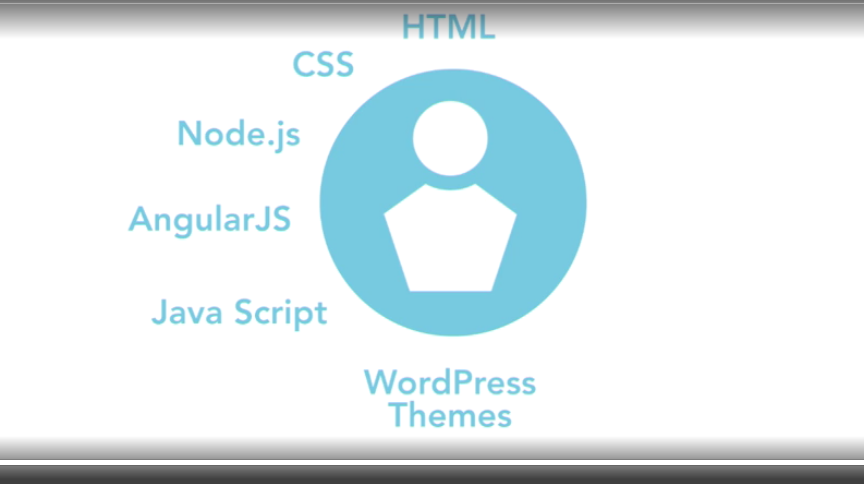

# MC UI Trainer

This repository hosts the code for the MC UI Trainer project.

## Table of Contents

- [MC UI Trainer](#mc-ui-trainer)
    - [Repository Link](#repository-link)
    - [Overview](#overview)
    - [Features](#features)
    - [HTML](#html-learning)
    - [CSS](#css-learning)
    - [JS](#javascript-learning)
    - [TS]()

## Repository Link

[MC UI Trainer GitHub Repository](https://github.com/blaze-b/mc-ui-trainer.git)

## Overview

The MC UI Trainer is designed to help users train and optimize user interfaces in Minecraft.
This tool aims to improve the user experience by providing customizable training modules
and analytics.

1. HTML(HyperText Markup language)
2. CSS (Cascading Style Sheets)
3. JavaScript
4. [Interactive web design](./docs/interactive-web-design.md)

## Features

- **Customizable Training Modules:** Create and edit training modules to suit specific needs.

## HTML learning

The html forms are added in the directory `mc-html-trainer`, [LINK](././mc-html-trainer/README.md)



## CSS learning

The css details are added in the directory `mc-css-trainer`, [LINK](././mc-css-trainer/README.md)

## Javascript learning

To clone and run this project, you'll need [Git](https://git-scm.com)
and [Node.js](https://nodejs.org) installed on your computer. From your command line:

JavaScript is basically the EcmaScripts,

- `<script>` tag is used
- `var` is the datatype
- `=` for the assignment of values
- `==` for the checking of values
- It also helps in animating

```bash

# Clone this repository
$ git clone https://github.com/blaze-b/mc-ui-trainer.git

# Go into the repository
$ cd ./mc-ui-trainer/mc-javascript-trainer

# Run the app
$ ./driver.sh

```

## Typescript learning

- TypeScript is a superset of JavaScript
  - Language developed by Microsoft in 2012
  - Free and open-source programming language
- TypeScript is a statically typed language
  - Helps in catching errors at compile time
- TypeScript is a strongly typed language
- Add support for classes, interfaces, and modules
- Classes, interfaces, and modules help in organizing the code
- Website link: [TypeScript](https://www.typescriptlang.org/), [Type script details](./docs/typescript-details)
