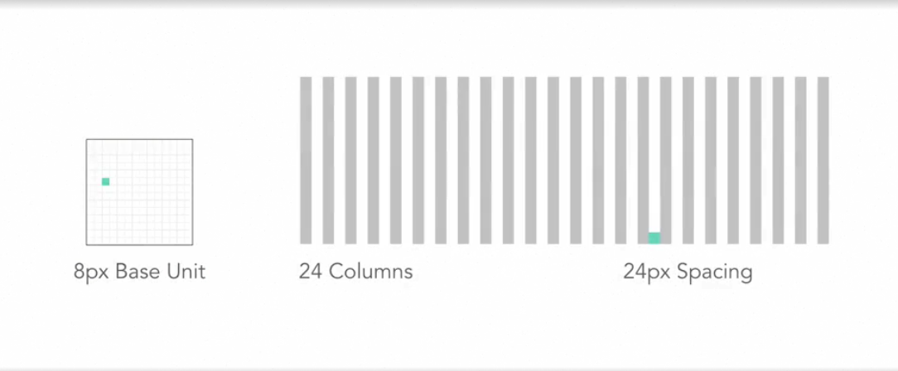
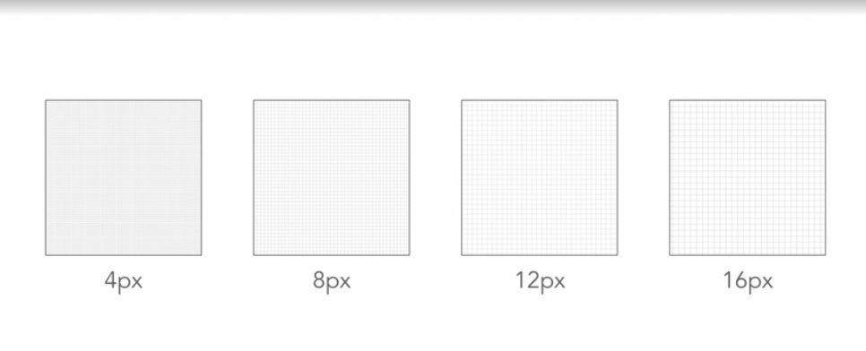

# UI-Details

- User Interface design represents the underlying structure informed by user needs and business needs.

### Brand Reinforcement

1. Color
2. Animation
3. Illustration
4. Imagery
5. Iconography

### Features

- Visual Design gives aesthetic appeal
- Iconography can provide guidance
- Hierarchy and layout determine prioritization.
- Readability and scalability help keep information organized and legible.
- Visual design communicates how the elements are related to each other.

## Gestalt Principles

- It describes how to perceive the information,
    1. Proximity
        - Perception of relationships between objects close that are close to each other.
    2. Similarity
        - Perception of relationships between objects similar to each other
    3. Closure
    4. Continuity
    5. Connection

## Accentuate Relationships

- Position
- Size
- Shape
- Color

### Grouping elements

- Containers
- Line Separators
- Color Containers

## Hierarchy

- Headings establish hierarchy when used to separate page sections
- Headings and ordering of contents help to establish priority

## Grids

- Grids are flexible and organize and determine information density.
- It is made of units of measure in pixels, points or percentages.
- It is basically the 24 Column and 12 Column.
- The white spaces are called the Gutters.
- The number of columns is a divisible number of the grid units.
- Each grid square is based on a unit of measure.
- Grid size

  

- Pixel sizes

  

## Typography

- It establishes hierarchy
- Content:
    1. It should be concise, succinct and usable,
        - Headings
        - Buttons
        - Field Labels
        - Help Text
        - Table Headings
        - Content
    2. Bold, Italics for emphasis
    3. Underlined can be used but not for emphasizing
    4. Uppercase for short headings
    5. Sentence casing
    6. Always Left aligned
    7. Don't use less than 11 px for body copy
    8. Icons
        - It supports content scalability
        - It should appear related to each other and belong to the same set
        - Test icons on various backgrounds and for cultural appropriateness
        - Line Weights should be considered
        - Fill Style -> Solid Color or outlined
        - Coloring
    9. Colors
        - It can be used to associate information and convey hierarchy
        - It provide emphasis
        - Gray used to de-emphasize elements.
        - Gradient and drop shadows can add depth and dimension
        - Contrast Ratio must allow for distinguishing elements from the background
        - Run through Contrast Checker
    10. Illustrations
        - For Onboarding
        - Describe and support content
        - Empty States

## Data

- Preset data in a meaningful way
- Time based data
- Correlational Data, Trends and Pattern
- Tables for filtering and sorting

## Animations

- To provide feedback to the users.
- Ease Abrupt actions
- Changes in view
- Communicate relationships between views and actions
- To communicate transitions 
