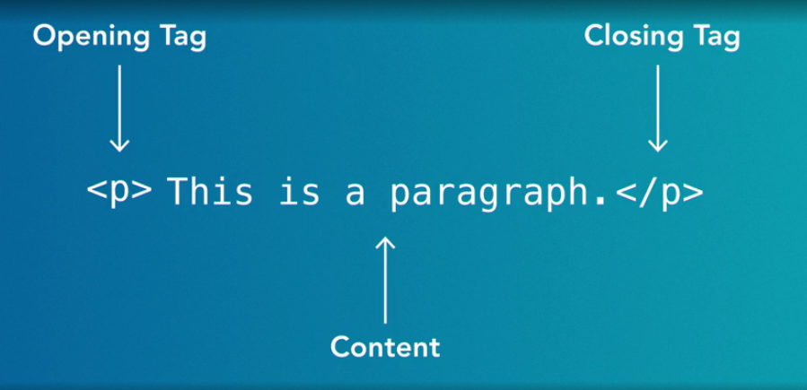

## HTML Essential Training

### Introduction

* It stands for the HyperText Markup Language
* It defines the content of the sites
* Simple syntax `<code>
</code>` - stands for paragraph
* Each tag is called an element

### Basic Structure

### DOM Tree (Document Object Model)

* The hierarchy and structure of the HTML elements, often used for targeting elements in CSS and JavaScript
* URL for immediate HTML coding and testing: [codepen.io](https://codepen.io/pen/)

### HTML Attributes

1. **Headlines element**: `<h1>Content...</h1>` (There are six headline tags: `<h1>`, `<h2>`, `<h3>`, `<h4>`, `<h5>`, `<h6>`, with `<h1>` being the largest), [example](./app/01-basic.html)

2. **Paragraph element**: `
Content...
`, [example](./app/01-basic.html)

3. **Bold or Italics elements**:
   - `<i>` for visual-only italics. [example](./app/01-basic.html)
   - `<em>` for emphasis italics, [example](./app/01-basic.html)
   - `<strong>` for importance, seriousness, and urgency, [example](./app/01-basic.html)
   - `<b>` for bold text, [example](./app/01-basic.html)

4. **List elements**:
   - Unordered lists `<ul>` for list items with bullets, [example](./app/02-list.html)
   - Ordered lists `<ol>` for list items with numbers, [example](./app/02-list.html)
   - `<dl>` for definition lists, [example](./app/03-definition-list.html)

5. **Date & Time element**: [example](./app/04-date-time.html)

6. **Quotes elements**:
    - `<q>` for inline level element, [example](./app/05-quotes.html)
    - `<blockquote>` for block level element, [example](./app/05-quotes.html)

7. **Code, pre, br elements**: [example](./app/06-code.html)

8. **Math, Subscripts, Superscripts elements**: [example](./app/07-subscripts-small-texts.html)

9. **Supporting languages**:
    - `lang` element -> `lang="en-US"` for American English, `lang="en-GB"` for British English
    - `lang` attributes -> Language, Script, Attributes, [example](./app/08-supporting-languages.html)

10. **Link element**: [example](./app/09-links.html)

11. **Video attributes**:
    - `<video>` video element, [example](./app/10-video.html)
    - `<track>` for captions and subtitles, [example](./app/11-video-captions-subtitles.html)
    - `<iframe>` for embedding videos, [example](./app/12-embedding-media.html)

12. **Global attributes, aria roles, formatting, & character**:
    - Global attributes, [example](./app/13-global-attributes.html)
    - Aria role attributes, [example](./app/14-aria-roles.html)
    - Formatting, [example](./app/15-formatting.html)
    - Weird characters, [example](./app/16-weird-characters.html)

13. **Navigation element**: [example](./app/17-navigation.html)

14. **Breadcrumb element**: [example](./app/18-breadcrumbs.html)

15. **Generic elements**: `div` and `span`, [example](./app/19-generic-elements.html)

16. **Images and graphics**: `img`, `srcset`, `figure`, and `figcaption` elements, [example1](./app/20-image-formats.html), [example2](./app/21-image-responsive.html), [example3](./app/22-image-responsive-width.html), [example4](./app/23-image-responsive-image.html), [example5](./app/24-image-figure-figcaption.html), [example6](./app/25-image-responsive-multiple.html)

17. **Audio element**: [example](./app/26-audio.html)

